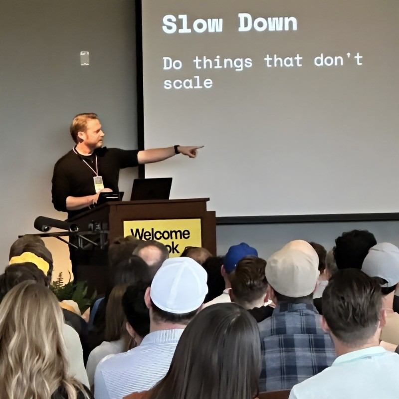

---
theme:
  color:
    bg: "#f3f7f8"
    fg: "#152024"
    muted: "#5f6d72"
    surface: "#ffffff"
    link: "#0f7a8a"
    accent: "#0f7a8a"
    border: "#d3e0e3"
    focus: "#0f7a8a"
  prose:
    size: 1.0625rem
    leading: 1.68
  measure: 53rem
  shape:
    radius: 0.75rem
  dark:
    color:
      bg: "#0c1416"
      fg: "#eef6f7"
      muted: "#9aadb2"
      surface: "#152225"
      link: "#5ec8d4"
      accent: "#5ec8d4"
      border: "#2a3b3f"
      focus: "#7ad6e0"
styles:
  classes:
    - landing-page
---

<!--
id: hub-header
styles:
  classes:
    - page-header
-->

[@components]: ./labs/layout-components/layout.components.md
[@root.styles]: ./styles/base.css

# Learn with Codex

**OpenAI Build Week 2026 · PathMX Learning Labs**

## What we built

We built a Markdown-first learning harness that helps Codex turn a learner's
goal into a structured, playable Path they can keep, revise, and resume.

<div class="pmx-wide">
<grid cols="3" gap="4">
  <project-feature
    title="Start a learning space"
    href="./guides/start-learning-with-codex.guide.md"
    cta="Copy the prompt"
  >
    <slot name="icon">:lucide-terminal:</slot>
    Give Codex one hosted instruction URL. It installs the current tools,
    creates a personal repository, asks the useful questions, and opens the
    first playable map.
  </project-feature>
  <project-feature
    title="Read the featured eval report"
    href="./research/learning-agent-evals.brief.md"
    cta="Read the report"
  >
    <slot name="icon">:lucide-gauge:</slot>
    Inspect the submission's real Codex CLI harness, phase contracts, scoring
    rubric, latency data, charts, failures, and the shipped changes they drove.
  </project-feature>
  <project-feature
    title="Explore the learning labs"
    href="./labs/index.path.md"
    cta="Open the labs"
  >
    <slot name="icon">:lucide-flask-conical:</slot>
    Try focused lessons, simulations, practice tools, and personal knowledge
    experiments authored as ordinary PathMX Sources.
  </project-feature>
</grid>
</div>

---

## Try the (experimental) learner flow

Open an empty writable folder in Codex Desktop and send this prompt:

```text
Follow the instructions at https://raw.githubusercontent.com/pathmx/pathmx-skills/main/bootstrap.md. Create a new learning space in ./learning-space and help me learn [your topic or goal].
```

The hosted file is the canonical entry point. The agent takes it from there;
you do not need to clone this repository or know Bun, Git, or PathMX first.

**Note: when we say experimental, we mean it. See the [eval results](./research/learning-agent-evals.brief.md) for more details on how things went.**

---

## Our Team

<div class="pmx-wide">
<grid cols="3" gap="4">
  <team-member
    name="Mark Johnson"
    role="Learning system + integration"
    initials="MJ"
    href="https://www.linkedin.com/in/wmdmark/"
  >
    <slot name="avatar">
      
    </slot>
    Shaped the PathMX learning model, Starter architecture, eval harness, and
    the integration work connecting Codex authoring to the Player.
  </team-member>
  <team-member
    name="Tram Le"
    role="Learner testing + research"
    initials="TL"
    href="https://www.linkedin.com/in/tramle2606/"
  >
    <slot name="avatar">
      
    </slot>
    Tested the early learner loop as a beginner, contributed the Campus
    Constellation exploration, and surfaced the structure and waiting-time
    problems that drove the buffered `/learn` workflow.
  </team-member>
  <team-member
    name="Andrew Miller"
    role="Learning labs + review"
    initials="AM"
    href="https://www.linkedin.com/in/andrew-miller-37b97582/"
  >
    <slot name="avatar">
      
    </slot>
    Built and tested the chess lesson, developed the Relationship Garden and
    Greenville concepts, and reviewed the authoring workflow through concrete
    learning experiments.
  </team-member>
</grid>
</div>

---

## PathMX

Our workflow and lab examples use [PathMX](https://pathmx.dev), a new methodology
and toolchain for authoring curriculum as readable Markdown Sources. PathMX
builds those Sources into a linked graph and a Player for focused, interactive
progress. This site and its linked examples are PathMX content.

PathMX is currently in Labs: its core source remains private while its APIs and
product boundaries stabilize. The installable CLI can be used to author,
build, and play PathMX projects. Expect rapid changes.

We intend to open-source substantial portions of PathMX once those boundaries
stabilize, but the exact scope, license, and timing are not yet set.

During Build Week we used Codex to extend that Core alongside the public work
collected here. See the [PathMX Core progress log](./work-log/pathmx-changes.log.md)
for a self-contained, living account of what landed during the Build Week
window.

## How we built this

We kept the work, decisions, and agent instructions in the same repository.
Humans and Codex could therefore work from the same durable context instead of
reconstructing it from chat history.

- [:lucide-list-todo: Tasks](./tasks/index.tasks.md) — The working queue for our team and our agents.
- [:lucide-git-commit-horizontal: Changes](./work-log/changes.log.md) — The living log of what was built during the build week.
- [:lucide-flask-conical: Labs](./labs/index.path.md) — Lab experiments and demos.
- [:lucide-library: Research/Reference](./research/index.path.md) — Research and reference materials.
- [:lucide-notebook-pen: Work log/notes](./work-log/index.path.md) — Work log and notes.
- [:lucide-book-open: Guides](./guides/index.guides.md) — Guides and documentation.

---

## Featured Work

These are the demos, presentation materials, and other work we built during the build week.

- [Submission walkthrough](./presentation/submission-walkthrough.slides.md) — The three-minute public Path that tells the learning story end to end.
- [Featured: Learning-Agent Evals](./research/learning-agent-evals.brief.md) — Build Week technical report with method, scoring evidence, latency data, charts, changes, and limits.
- [Eval Findings Deck](./presentation/walkthrough.slides.md) — Concise internal-review walkthrough of the same evidence.
- [PathMX Build Week (this repository)](https://github.com/pathmx/pathmx-build-week-2026) — Labs, tasks, and the living record of Build Week collaboration.
- [PathMX Learning Starter](https://github.com/pathmx/pathmx-learning-starter) — The learner-facing starter for durable personal learning Paths.
- [PathMX Skills](https://github.com/pathmx/pathmx-skills) — Canonical agent skills for authoring PathMX and guiding personal learning.
