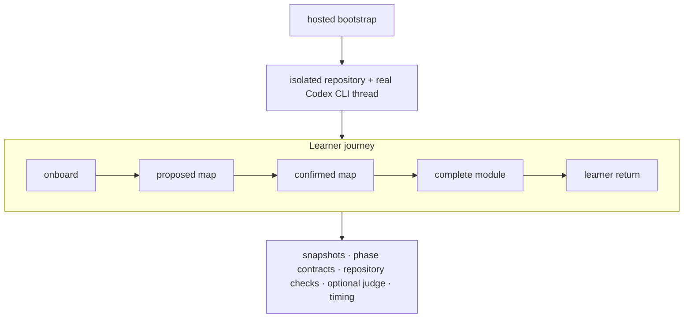

[@charts]: ./learning-agent-evals.components.md
[@lab-stats]: ../styles/lab.components.md
[@styles]: ./learning-agent-evals.css

# Evaluating a repository-guided learning agent

### Build Week technical report: PathMX bootstrap, authoring, latency, and return

**OpenAI Build Week 2026 · PathMX Learning Labs · July 21, 2026**

PathMX Learning Labs is our Build Week submission: a Markdown-first system that
lets Codex turn one learner's goal into a structured, playable learning space
the learner owns. This featured report documents how we tested the full flow
from one hosted instruction file to a durable personal repository, what failed,
and how those failures changed the shipped skills and Starter.

The report uses the conventions of a technical research post—brief summary,
method, results, validation, and limits—so judges can inspect the evidence
behind the submission rather than relying only on a demo.

## In brief

- A real Codex CLI session followed the same `bootstrap.md` entry intended for
  Codex Desktop users.
- Phase contracts tested map-first planning, confirmed-module authoring, and a
  later learner return separately.
- Deterministic repository checks measured artifact validity. An independent
  model judge measured learning quality on selected runs. Timing telemetry
  measured the learner experience separately from either score.
- The strongest candidate runs reached 100% deterministic checks and 100%
  judge scores, but early default-strength runs still exposed unacceptable
  waits, including a 12m43s turn.
- The published PathMX 0.1.25 hosted-bootstrap smoke passed every deterministic
  check; its 11m07s model time and 6m20s module turn still triggered the
  learner-latency warning.
- Buffered modules and early persisted maps improved the usable learning
  runway. Two same-model subagents shortened the longest silent interval in
  one comparison, but increased first-module wall time.

<lab-stats label="Current evidence summary">
  <lab-stat value="4" label="Learner scenarios" detail="Concrete, ambiguous, offline, and returning">
    <slot name="icon">:lucide-users:</slot>
  </lab-stat>
  <lab-stat value="5" label="Measured phases" detail="Onboard through learner return">
    <slot name="icon">:lucide-layers:</slot>
  </lab-stat>
  <lab-stat value="100%" label="Candidate checks" detail="Selected final candidate flows">
    <slot name="icon">:lucide-badge-check:</slot>
  </lab-stat>
  <lab-stat value="4–13s" label="First useful update" detail="Every measured candidate turn">
    <slot name="icon">:lucide-zap:</slot>
  </lab-stat>
</lab-stats>

---

## The submitted system

The public submission has four cooperating artifacts:

| Artifact | Responsibility |
| --- | --- |
| Hosted bootstrap | Gives a nontechnical learner one prompt and one stable URL |
| Canonical skills | `/pathmx` owns authoring; `/learn` owns personal learning; `/teach` owns reusable curricula |
| Learning Starter | Supplies the private repository, readable defaults, Player tutorial, durable profile, activity log, and checks |
| Eval harness | Rehearses the real multi-turn Codex journey and scores artifacts, phase boundaries, collaboration, and latency |

The Build Week repository contains this evidence, the manual test protocol,
the Player-native learning labs, tasks, and the public submission walkthrough.
The learner-facing entry remains deliberately smaller:

```text
Follow the instructions at https://raw.githubusercontent.com/pathmx/pathmx-skills/main/bootstrap.md. Create a new learning space in ./learning-space and help me learn [your topic or goal].
```

---

## 1. Research question

Starting from only a hosted instruction file, can a coding agent create and
maintain a useful personal learning repository for a nontechnical learner?

We separated five acceptance dimensions:

1. **Structure:** persist a whole-path map before substantial teaching.
2. **Learning quality:** provide examples, practice, hints, review, and checks.
3. **Repository quality:** leave valid PathMX and durable progress evidence.
4. **Continuity:** adapt honestly when the learner returns with new evidence.
5. **Responsiveness:** expose useful progress without making the learner wait
   for generation between ordinary lesson steps.

The last dimension is intentionally independent. A high-quality artifact that
arrives after a long silent turn is still a weak live learning experience.

## 2. Experimental system

The harness runs the real Codex CLI in an isolated temporary repository. It
uses a multi-turn scenario rather than asking one model call to simulate the
entire journey.



At every phase the harness records the transcript, repository snapshot, Git
state, command output, timing events, and scoring evidence. Candidate Starter
substitution is explicit; a local checkout is never silently represented as a
release run.

### Scenario matrix

| Scenario | Learner goal | Main failure surface |
| --- | --- | --- |
| SQL beginner | Ask useful questions of customer data | Setup, scaffold, exact Player route |
| Ambiguous AI | Understand a vague “learn AI” goal | Clarification and map boundary |
| Offline guitar | Practice away from the screen | Modality and durable evidence |
| Returning learner | Report confusion after a session | Honest progress and adaptation |

### Runtime profiles

| Profile | Subject configuration | Purpose |
| --- | --- | --- |
| Desktop power | Default-strength Codex model | Expected quality ceiling |
| Desktop fast | Sol, low reasoning | Faster likely learner-facing lane |
| Instruction floor | Lower-reasoning subject | Test whether instructions carry behavior |
| Judge | Independent structured grader | Review learning quality, not latency |

The current series spans PathMX 0.1.21–0.1.25 and Codex CLI
0.142.5–0.145.0. The latest run uses the public bootstrap and Starter on the
published 0.1.25 release.

## 3. Measures

### Deterministic artifact checks

Checks inspect repository structure and content rather than grading the chat:
the configured root, persisted map, milestone states, session runway, worked
examples, hints, immediate feedback, review, checkpoint, activity history,
private defaults, and a successful PathMX build.

Critical failures cap the result when the repository is unusable even if many
smaller checks pass. Phase contracts also reject work created too early—for
example, session Sources written before the learner confirms the map.

### Independent quality judge

Selected runs pass the final snapshot and visible learner contract to a
separate model with a structured rubric. The judge does not replace build and
repository checks and is omitted when the experiment is specifically measuring
the subject turn, such as the subagent comparison.

### Learner-visible latency

For each turn the harness records:

- total duration;
- time to first useful visible update;
- longest silent interval;
- any turn over five minutes;
- whether staged updates correspond to real repository progress.

## 4. Default-strength results

All four flows produced valid final artifacts. Latency varied much more than
quality.

<eval-bars label="Total flow time by default-strength scenario" caption="Figure 1. Total end-to-end flow time, normalized to the 18m55s ambiguous-goal run. Bar length is redundant with the printed duration.">
  <eval-bar label="SQL beginner" value="8m55s" percent="47" detail="100% deterministic checks"></eval-bar>
  <eval-bar label="Ambiguous AI goal" value="18m55s" percent="100" detail="100% checks + judge; one 12m43s turn"></eval-bar>
  <eval-bar label="Offline guitar" value="10m51s" percent="57" detail="100% deterministic checks"></eval-bar>
  <eval-bar label="Return with confusion" value="13m46s" percent="73" detail="100% checks + judge"></eval-bar>
</eval-bars>

The ambiguous-goal run is the clearest negative result: its artifact passed,
but its final turn took 12m43s. This motivated treating progress visibility and
ready learning runway as first-class requirements.

## 5. Failure-driven instruction changes

Lower-reasoning runs exposed missing contracts in sequence.

| Iteration | Observed failure | Resulting change |
| --- | --- | --- |
| Initial | Module authored before map confirmation | Map-first phase contract |
| Map-only | Boundary respected, map left only in chat | Persist and link proposed Path |
| Persisted map | Invalid extra Player root | One configured root; nested linked Paths |
| Thin sessions | Valid files without enough learning support | Required example, hint, feedback, review, checkpoint |
| Broad route lookup | Ambiguous or incorrect handoff URL | Exact-source route resolution |
| Long silent work | Good result with weak live experience | Early map, staged updates, buffered module |

These were not prompt-only patches. The contracts now live in canonical skills,
Starter instructions, templates, fixtures, and automated checks so the next
agent can recover the intended behavior from the repository.

## 6. Final candidate behavior

Two focused candidate flows—ambiguous goal and return with confusion—reached
100% deterministic and judge scores. Their total flows were 6m56s and 10m07s;
no turn exceeded five minutes. Every measured turn showed a useful first update
within 4–13 seconds.

This is evidence that staged authoring can make work legible while a complete
module is being built. It is not yet a stable latency estimate: the candidate
needs repeated release runs across machines and normal Codex Desktop sessions.

## 7. Hosted PathMX 0.1.25 release smoke

After publishing the canonical skills and Starter, we ran the SQL beginner
scenario from the public raw bootstrap URL on the Desktop Power profile.

| Result | Evidence |
| --- | --- |
| Repository quality | 100% deterministic checks; every critical check passed |
| Release contract | Exact dependency and compatibility baseline both 0.1.25 |
| Model time | 11m07s total; confirmed module 6m20s |
| Progress visibility | First useful updates in 4–11 seconds |
| Silence | Longest gap 1m56s; two turns exceeded one minute |
| Collaboration | Two Sol child threads in the module; no errors |

<eval-bars label="Hosted release smoke timing by phase" caption="Figure 2. PathMX 0.1.25 hosted-bootstrap Power run, normalized to the 6m20s confirmed-module turn. Quality passed; latency remained in attention status.">
  <eval-bar label="Bootstrap" value="2m12s" percent="35" detail="Public instruction and Starter setup"></eval-bar>
  <eval-bar label="Preferences" value="55s" percent="14" detail="Learner constraints and style"></eval-bar>
  <eval-bar label="Point A + map" value="1m40s" percent="26" detail="Persisted proposal before lessons"></eval-bar>
  <eval-bar label="Confirmed module" value="6m20s" percent="100" detail="Three sessions, review, checkpoint, verification"></eval-bar>
</eval-bars>

The default eval sandbox blocked global tool updates and Player state under
`~/.pathmx`. The agent reported the limitation, used the exact project
dependency, passed the repository build, and supplied the verified route. A
manual Codex Desktop run remains necessary for normal Player startup and
integrated Browser handoff.

## 8. Subagent experiment

We then tested whether bounded child agents could shorten the first confirmed
module build on the fast profile. Collaboration-disabled served as the control.

| Lane | Workers | Module turn | Longest silence | Total flow | Quality |
| --- | ---: | ---: | ---: | ---: | ---: |
| Collaboration disabled | 0 | 3m04s | 1m43s | 6m00s | 100% checks |
| Required, optional wording | 0 | 4m08s | 1m51s | 7m52s | Content passed; worker proof failed |
| Explicit bounded workers | 2 Sol/low | 4m35s | 1m05s | 7m28s | 100% checks |
| One fixed join | 2 Sol/low | 4m24s | 1m10s | 7m55s | 100% checks |

<eval-bars label="First-module duration by collaboration lane" caption="Figure 3. Confirmed-module turn duration, normalized to the 4m35s explicit-worker run. In this sample, worker coordination increased wall time.">
  <eval-bar label="Collaboration disabled" value="3m04s" percent="67" detail="Control; no workers"></eval-bar>
  <eval-bar label="Optional wording" value="4m08s" percent="90" detail="No workers actually started"></eval-bar>
  <eval-bar label="Explicit workers" value="4m35s" percent="100" detail="Two Sol/low child threads"></eval-bar>
  <eval-bar label="One fixed join" value="4m24s" percent="96" detail="Two Sol/low child threads"></eval-bar>
</eval-bars>

<eval-bars label="Longest silent interval by collaboration lane" caption="Figure 4. Longest silence during the module turn, normalized to 1m51s. Workers improved cadence after the skill made delegation explicit, but the remaining gap still exceeds the one-minute warning threshold.">
  <eval-bar label="Collaboration disabled" value="1m43s" percent="93" detail="Control"></eval-bar>
  <eval-bar label="Optional wording" value="1m51s" percent="100" detail="No worker start"></eval-bar>
  <eval-bar label="Explicit workers" value="1m05s" percent="59" detail="Two child threads"></eval-bar>
  <eval-bar label="One fixed join" value="1m10s" percent="63" detail="Two child threads"></eval-bar>
</eval-bars>

The optional instruction was too weak for the low-reasoning subject. Explicit
instructions produced two child threads only after map confirmation and kept
the first session, shared state, integration, verification, and learner handoff
with the parent.

Two separate probes asked Codex to use a Terra/low worker, once through natural
language and once through a project-scoped named agent. Both child rollouts
were Sol/low. The Starter therefore does not ship or advertise a faster worker
configuration that this harness could not verify.

## 9. What the evidence supports

**Supported by the current runs**

- The map-first boundary, persisted proposal, buffered module, exact route,
  and return/adapt flow can produce valid, useful artifacts.
- Repository-scoped contracts help a lower-reasoning agent recover behavior
  that was previously supplied by ad hoc prompting.
- A small direct-worker lane can improve update cadence while preserving state
  ownership when the instructions make its boundary explicit.
- For the measured three-session module, subagents were not a wall-clock speed
  improvement.

**Not yet established**

- Latency variance across repeated runs, machines, and normal Desktop sessions.
- Whether larger later-module work can amortize same-model worker coordination.
- Whether current Codex surfaces will expose a reliable per-worker model choice.
- The integrated Browser and permission experience across ordinary users.

## 10. Current design decisions

1. Keep the buffered 2–4-session module as the primary learner-speed strategy.
2. Persist and open the proposed map before substantial module generation.
3. Use workers only for independent later outputs after confirmation.
4. Keep all learner state transitions, the first session, integration, and
   handoff in the parent agent.
5. Use one fixed join point; do useful parent work instead of polling workers.
6. Treat a model switch as unverified unless child rollout evidence confirms it.
7. Keep the hosted raw `bootstrap.md` as the canonical one-prompt entry.

## 11. Next validation

1. Run one larger later-module or return-flow pair with collaboration disabled
   and required;
2. Repeat any apparent improvement before claiming a speed effect.
3. Run the matching manual Codex Desktop guide and record permission, Browser,
   Player, first-update, and silent-gap observations.

The exact manual protocol is in
[Self-learning system: Codex Desktop manual test](../guides/self-learning-manual-test.guide.md).
The concise companion deck is
[Codex learning-system eval review](../presentation/walkthrough.slides.md).

### Data and reproducibility note

The harness, scenarios, rubric, and the summarized subagent candidate result
live in the public `pathmx-skills` repository. Raw isolated run directories are
retained locally for inspection because they contain full agent transcripts
and generated learner repositories; they should be reviewed before any public
release.

Public artifacts:

- [PathMX Skills and eval harness](https://github.com/pathmx/pathmx-skills)
- [PathMX Learning Starter](https://github.com/pathmx/pathmx-learning-starter)
- [PathMX Build Week 2026](https://github.com/pathmx/pathmx-build-week-2026)
