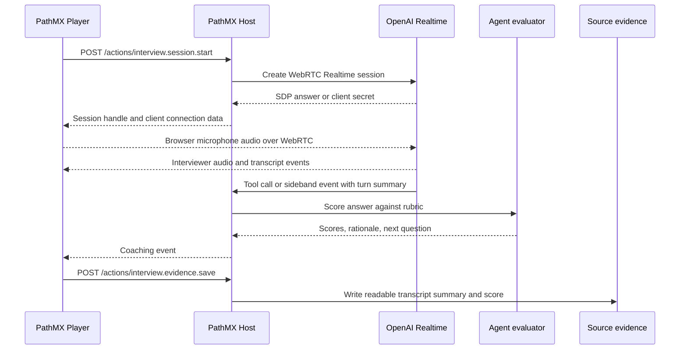

# Practice Interview Voice Agent

This spike explores a PathMX path where a learner answers interview questions
aloud and receives rubric-based coaching from an agent. The learner-facing
experience should feel like a live practice interview; the durable artifact
should still be ordinary readable Source evidence that a human or Codex can
inspect after the session.

The short version: use a browser WebRTC speech-to-speech Realtime session for
the live interview, keep scoring and persistence on trusted server endpoints,
and make the PathMX source record the transcript, rubric result, next route,
and reviewer notes rather than raw audio.

---

<!--
type: research
id: current-openai-shape
title: Current OpenAI Realtime Shape
-->

## Current OpenAI Realtime Shape

Official OpenAI guidance points to voice-agent sessions for assistants that
respond to the user, call tools, and manage conversation state. For browser
and mobile clients that capture or play audio directly, OpenAI recommends
WebRTC over WebSockets for more consistent performance.

For this use case, that suggests:

- model: `gpt-realtime-2.1` for the live voice agent;
- client transport: WebRTC in the browser;
- session start: a developer-controlled server calls the Realtime API and
  returns the session answer or client secret;
- scoring and evidence: server-owned tools or sideband control, not browser
  secrets or browser-only state;
- prompt shape: short structured sections for role, objective, rubric,
  conversation flow, tool rules, and fallback behavior.

Sources:

- [Realtime and audio overview](https://developers.openai.com/api/docs/guides/realtime)
- [Realtime API with WebRTC](https://developers.openai.com/api/docs/guides/realtime-webrtc)
- [Voice agents](https://developers.openai.com/api/docs/guides/voice-agents)
- [Realtime conversations](https://developers.openai.com/api/docs/guides/realtime-conversations)
- [Realtime with tools](https://developers.openai.com/api/docs/guides/realtime-mcp)
- [Webhooks and server-side controls](https://developers.openai.com/api/docs/guides/realtime-server-controls)
- [Using realtime models](https://developers.openai.com/api/docs/guides/realtime-models-prompting)

---

<!--
type: design
id: experience-brief
title: Experience Brief
-->

## Experience Brief

**Thesis:** Make interview practice feel like a short realistic conversation
while preserving concrete evidence the learner can use to improve.

**Arrival:** The learner sees the role they are practicing for, the first
question, the rubric, and the privacy boundary before microphone access starts.

**Anti-targets:** Not a generic chatbot, not a hidden score with no rationale,
not a raw transcript dump, and not a browser-only voice toy that cannot inform
the next PathMX block.

**Arc:** Choose interview type, hear one question, answer aloud, receive a
rubric score, rehearse one targeted follow-up, then choose the next route.

**Controls:** Start session, pause or stop, repeat question, skip question,
request a follow-up, and save final evidence.

**Visible consequences:** The learner can see transcript status, rubric
dimensions, a concrete revision target, and the proposed next practice path.

**Protected invariants:** The agent scores against the disclosed rubric, gives
one improvement target at a time, separates transcript evidence from coaching,
and does not store raw audio in Source.

**Proof:** A reviewer can run the local PoC route, see the same four-stage
flow, score a sample answer, and inspect the proposed endpoint contracts.

---

<!--
type: architecture
id: proposed-loop
title: Proposed Loop
-->

## Proposed Loop



The critical product choice is where tool calls run. OpenAI documents
function tools for application-owned logic and sideband server connections for
WebRTC sessions. For Build Week, scoring and persistence should stay on the
PathMX Host so the browser never owns API keys, private rubric rules, or final
Source writes.

---

<!--
type: contract
id: host-action-shape
title: Proposed Host Action Shape
-->

## Proposed Host Action Shape

These are design shapes, not landed PathMX Actions.

### `interview.session.start`

Purpose: create the Realtime voice session and return only browser-safe
connection data.

Request:

```json
{
  "sourcePath": "paths/labs/practice-interview/index.demo.md",
  "blockId": "behavioral-loop",
  "actorId": "actor-local",
  "interview": {
    "role": "Frontend engineer intern",
    "mode": "behavioral",
    "rubricId": "star-v1"
  }
}
```

Response:

```json
{
  "sessionId": "interview_123",
  "realtime": {
    "transport": "webrtc",
    "model": "gpt-realtime-2.1",
    "expiresAt": "2026-07-16T21:30:00Z"
  },
  "client": {
    "sdpEndpoint": "/actions/interview.session.sdp",
    "eventChannel": "oai-events"
  }
}
```

### `interview.turn.score`

Purpose: score one answer turn and choose the next coaching move.

Request:

```json
{
  "sessionId": "interview_123",
  "questionId": "conflict-story",
  "transcript": "I had a teammate disagree with our design...",
  "rubric": ["structure", "evidence", "reflection", "delivery"],
  "durationSeconds": 93
}
```

Response:

```json
{
  "overall": 3.5,
  "scores": {
    "structure": 4,
    "evidence": 3,
    "reflection": 4,
    "delivery": 3
  },
  "strength": "Clear situation and action.",
  "revisionTarget": "Add one measurable result before the lesson learned.",
  "nextMove": "follow_up_result"
}
```

### `interview.evidence.save`

Purpose: write durable readable evidence back to the owning Source or actor
response file after the learner accepts the result.

Request:

```json
{
  "sessionId": "interview_123",
  "sourcePath": "paths/labs/practice-interview/index.demo.md",
  "blockId": "behavioral-loop",
  "evidence": {
    "question": "Tell me about a time you handled disagreement on a team.",
    "transcriptSummary": "Learner described a design conflict and facilitation step.",
    "scores": {
      "structure": 4,
      "evidence": 3,
      "reflection": 4,
      "delivery": 3
    },
    "nextRoute": "practice-result-proof"
  }
}
```

Response:

```json
{
  "status": "saved",
  "writtenTo": "paths/actors/actor-local/sessions/interview_123.response.md"
}
```

---

<!--
type: prompt
id: realtime-agent-prompt
title: Realtime Agent Prompt Sketch
-->

## Realtime Agent Prompt Sketch

```md
# Role & Objective

You are a practice interviewer for early-career software roles. Run one
question at a time, listen carefully, and coach the learner toward a better
answer.

# Personality & Tone

- Calm, direct, and concise.
- Sound like a thoughtful interviewer, not a motivational speaker.
- Keep spoken responses to 1-3 sentences unless the learner asks for detail.

# Rubric

Score each answer from 1 to 5 on:

- Structure: answer has situation, action, result, and lesson.
- Evidence: answer includes concrete details, stakes, or measurable outcomes.
- Reflection: answer explains why the choice worked and what changed later.
- Delivery: answer is clear, specific, and not overlong.

# Conversation Flow

1. Ask the question.
2. Let the learner answer without interruption unless they ask for help.
3. Summarize the answer in one sentence.
4. Call `interview.turn.score`.
5. Give one strength and one revision target.
6. Ask exactly one follow-up question based on the weakest rubric dimension.

# Tool Rules

- Use `interview.turn.score` after each complete answer.
- Do not invent durable scores without the tool result.
- Use `interview.evidence.save` only after the learner accepts the summary.

# Safety & Fallback

- If audio is unclear, ask the learner to repeat the last sentence.
- If the learner shares sensitive personal data, suggest a less identifying
  version before saving evidence.
```

---

<!--
type: decision
id: first-build-slice
title: First Build Slice
-->

## First Build Slice

Build the first real version in this order:

1. Host endpoint that creates a WebRTC Realtime session for one interview
   Block.
2. Browser component that can start, stop, and receive transcript/status
   events from the session.
3. Server-side scoring function that accepts transcript text and returns the
   rubric object.
4. Durable evidence save Action that writes a concise response artifact, not
   raw audio.
5. A PathMX path that branches to the next practice based on the weakest
   rubric dimension.

The open question is whether the PathMX Host should expose this as one
purpose-built interview Action family or as a more general custom Action
endpoint contract.

[Open the local PoC](../labs/practice-interview/index.demo.md).
